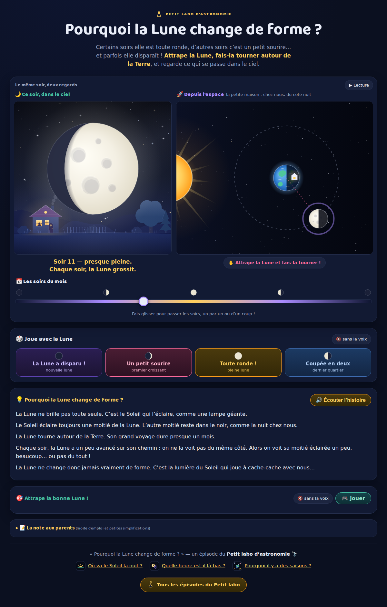

# Pourquoi la Lune change de forme ? 🌙

**Petit labo d'astronomie.** Un site d'une page, en français, pour
expliquer les phases de la Lune à un enfant d'environ 5 ans. Le parent lit à
voix haute ; l'enfant attrape la Lune, la fait tourner autour de la Terre, et
regarde sa forme changer dans le ciel.

L'idée centrale, celle que l'enfant doit retenir :

> La Lune ne change pas vraiment de forme : elle est toujours à moitié éclairée
> par le Soleil. C'est nous qui la voyons d'un côté différent chaque nuit,
> pendant qu'elle tourne autour de la Terre.



## Fonctionnalités

- **Le hublot « Ce soir, dans le ciel »**, en ouverture : la Lune vue du jardin
  (petite maison à la fenêtre allumée, sapins), avec sa forme du soir et la
  petite phrase du soir en dessous.
- **La vue « Depuis l'espace »** : la Terre et la Lune vues de très haut, le Soleil fixe à
  gauche, et une petite maison plantée sur le côté nuit de la Terre — c'est de
  là qu'on regarde. Le geste-signature de l'épisode : **attraper la Lune au
  doigt et la faire tourner** sur son orbite. Les deux vues restent toujours
  synchronisées.
- **Le grand curseur des soirs du mois** (0 → 29,5) pour faire défiler le cycle.
- **4 boutons-scénarios « 🎲 Joue avec la Lune »** : nouvelle lune, premier
  croissant, pleine lune, dernier quartier — l'animation rejoint le moment
  choisi en douceur, toujours dans le vrai sens de l'orbite, puis une
  micro-histoire raconte le moment (version sonore au bouton 🔇/🔊).
- **La boîte d'explication** à lire ou à **écouter** (synthèse vocale hors
  ligne, bouton « 🔊 Écouter l'histoire » — la meilleure voix française de
  l'appareil est choisie automatiquement).
- **Le jeu « 🎯 Attrape la bonne Lune ! »** : le site demande une phase,
  l'enfant la fabrique en manœuvrant la Lune — directement dans les mini-vues
  reprises sous le jeu (synchronisées avec celles du haut), sans remonter en
  haut de la page. Sur mobile, le jeu tient sur un écran : une seule vue, et
  c'est le médaillon flottant qui montre la Lune du soir.
- **Sur mobile**, un médaillon flottant montre la Lune du soir dès que le
  hublot sort de l'écran (scénarios, curseur, jeu…) — un tap y ramène.
- **La note aux parents**, repliable, qui documente honnêtement chaque
  simplification.

## Lancer en local

Aucune dépendance, aucun build :

```bash
python3 -m http.server 8123
# puis ouvrir http://localhost:8123/
```

## Tests

Le modèle est pur (aucun accès DOM) et se teste sous Node, sans navigateur :

```bash
node test/model.test.mjs
```

Les tests verrouillent les « vérités à préserver » de l'épisode :

1. la moitié éclairée de la Lune fait toujours face au Soleil ;
2. Lune entre Terre et Soleil → nouvelle lune ; Terre entre Soleil et Lune →
   pleine lune ;
3. l'ordre des phases ne s'inverse jamais (et la Lune grossit jusqu'à la pleine
   lune, puis rapetisse) ;
4. le tour complet dure 29,5 jours et le cycle reboucle.

## Ce que le site simplifie

- **Le cycle dure ici 29,5 jours** — le vrai mois synodique dure 29,53 jours en
  moyenne.
- **L'orbite est ronde et plate** — la vraie est légèrement elliptique
  (e ≈ 0,055) et inclinée d'environ 5° sur l'écliptique ; c'est cette
  inclinaison qui évite une éclipse à chaque nouvelle ou pleine lune (voir
  [La mécanique des éclipses](https://petit-labo.fr/eclipse-explorer/)).
- **Tailles et distances ne sont pas à l'échelle** (la Lune est à ~384 000 km).
- **Le hublot montre le ciel de l'hémisphère nord** : la Lune qui grossit y est
  éclairée à droite, celle qui rapetisse à gauche (l'inverse dans l'hémisphère
  sud).
- **Les heures de lever/coucher de la Lune sont ignorées** : le hublot montre la
  forme du soir, pas l'heure où on peut la voir.
- Côté enfant on dit « presque pleine » ; le mot savant est « lune gibbeuse ».
- La rotation synchrone (la Lune montre toujours la même face) n'est pas
  abordée.

## Structure

```
index.html          la page unique
css/style.css       le thème de la série astronomie
js/model.js         le modèle pur (géométrie, phases, scénarios, défis)
js/vue-orbite.js    la vue du ciel (canvas) + le geste-signature
js/vue-hublot.js    le hublot : la Lune vue du jardin (canvas)
js/main.js          le câblage : boucle rAF, curseur, scénarios, conteur, jeu
test/model.test.mjs les tests du modèle (Node, sans navigateur)
docs/               les captures d'écran
```

## La série

**Petit labo d'astronomie 🌌**

- [La mécanique des éclipses](https://petit-labo.fr/eclipse-explorer/)
- [Où va le Soleil la nuit ?](https://petit-labo.fr/ou-va-le-soleil/)
- [Quelle heure est-il là-bas ?](https://petit-labo.fr/la-terre-tourne/)
- **Pourquoi la Lune change de forme ?** (cet épisode)
